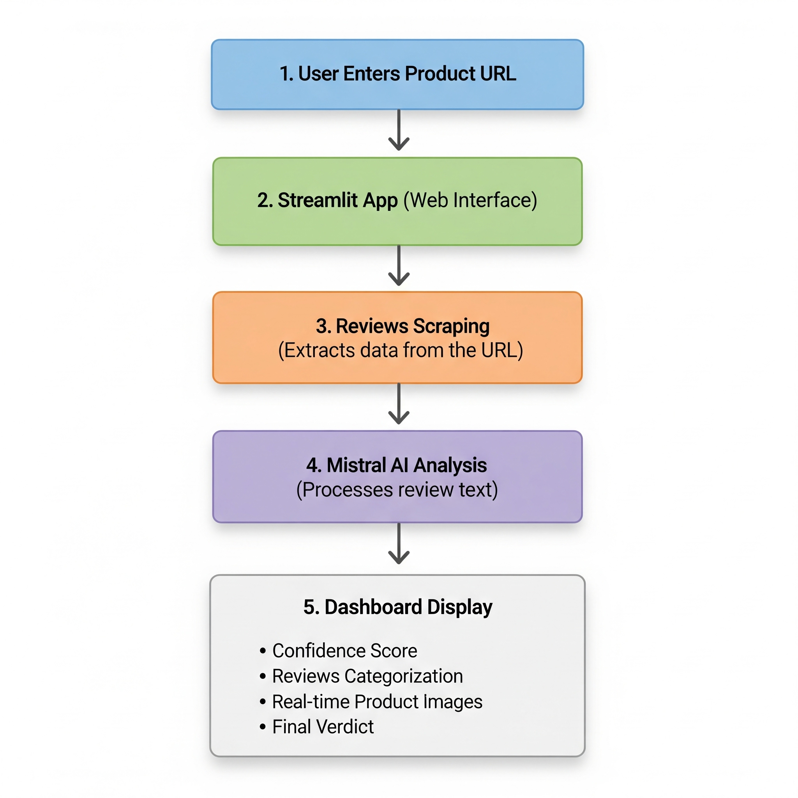

<h1 align="center">ReviewAI: AI-Powered Product Review Analysis</h1>

<p align="center">
  
</p>

<h1 align="center">ReviewAI</h1>

<p align="center">
  <strong>An intelligent web application that analyzes real buyer reviews to provide insightful product recommendations.</strong>
</p>

<p align="center">
  <a href="#features">Features</a> •
  <a href="#workflow">Workflow</a> •
  <a href="#getting-started">Getting Started</a> •
  <a href="#file-descriptions">File Descriptions</a> •
  <a href="#technologies-used">Technologies</a> •
  <a href="#contributing">Contributing</a> •
  <a href="#contact">Contact</a>
</p>

---

<a name="features"></a>
## Features

*   **One-Click Analysis:** Simply paste a product URL to get an instant, in-depth analysis of customer reviews.
*   **Advanced Sentiment Analysis:** Leverages the powerful Mistral AI to understand the sentiment and context of each review.
*   **Data-Driven Recommendations:** Provides a clear "Buy," "Buy with Caution," or "Do Not Buy" recommendation based on the analysis.
*   **Fraud Detection:** Helps identify low-quality or misleading products by analyzing patterns in reviews.
*   **Business Intelligence:** Enables businesses to track product perception, identify trends, and gather actionable customer feedback.
*   **Interactive Dashboard:** A user-friendly interface built with Streamlit to visualize the analysis results.

---

<a name="workflow"></a>
## Workflow

The project follows a simple yet powerful workflow to analyze product reviews and provide recommendations. The diagram below illustrates the entire process from user input to the final analysis.

<p align="center">
  
</p>

1.  **User Input:** The user provides a URL to a product page on an e-commerce website.
2.  **Web Scraping:** The `scraper.py` script, using Selenium, navigates to the provided URL and scrapes the customer reviews.
3.  **Sentiment Analysis:** The scraped reviews are then passed to the `genai_analysis.py` script, which utilizes the Mistral AI API to perform sentiment analysis on each review. The analysis includes a summary, sentiment (Positive/Negative), and a category (e.g., Quality, Delivery).
4.  **Display Results:** The `review_analysis_app.py` script takes the analysis results and displays them in an interactive Streamlit web application. The dashboard includes:
    *   A **Confidence Score** based on the percentage of positive reviews.
    *   A **Key Factors Checklist** that summarizes the product's quality, delivery experience, authenticity, and customer satisfaction.
    *   A **Sentiment Distribution Chart** to visualize the proportion of positive, negative, and neutral reviews.
    *   A **Review Browser** that allows users to filter and read the original reviews based on their sentiment.
    *   A **Final Verdict** with a clear recommendation and a summary of the findings.

---

<a name="getting-started"></a>
## Getting Started

To get a local copy up and running, follow these simple steps.

### Prerequisites

*   Python 3.7+
*   Google Chrome or Brave Browser

### Installation

1.  **Clone the repository:**
    ```sh
    git clone https://github.com/your_username/ReviewAI.git
    ```
2.  **Navigate to the project directory:**
    ```sh
    cd ReviewAI/Project_Data
    ```
3.  **Install the required dependencies:**
    ```sh
    pip install -r requirements.txt
    ```
4.  **Create a `.env` file** in the `Project_Data` directory and add your Mistral AI API key:
    ```
    MISTRAL_API_KEY=your_api_key_here
    ```

### Running the Application

1.  **Run the Streamlit application:**
    ```sh
    streamlit run review_analysis_app.py
    ```
2.  Open your web browser and go to `http://localhost:8501`.

### Running with Docker

The project is also containerized for easy deployment.

1.  **Build the Docker image:**
    ```sh
    docker build -t review-ai .
    ```
2.  **Run the Docker container:**
    ```sh
    docker run -p 8080:8080 -e MISTRAL_API_KEY=$MISTRAL_API_KEY review-ai
    ```

---

<a name="file-descriptions"></a>
## File Descriptions

Here's a breakdown of the key files and directories in the project:

```
Project_Data/
├── .env.example
├── .gitignore
├── genai_analysis.py
├── home.html
├── Procfile
├── README.md
├── requirements.txt
├── review_analysis_app.py
├── scraper.py
└── Docker/
    ├── .dockerignore
    ├── Dockerfile
    ├── genai_analysis.py
    ├── railway.toml
    ├── requirements.txt
    ├── review_analysis_app.py
    ├── scraper.py
    └── .streamlit/
        └── config.toml
```

*   **`review_analysis_app.py`**: The main Streamlit web application.
*   **`scraper.py`**: The web scraping script that extracts product reviews.
*   **`genai_analysis.py`**: The script that performs sentiment analysis using the Mistral AI API.
*   **`requirements.txt`**: A list of all the Python dependencies required for the project.
*   **`.env.example`**: An example file for the environment variables.
*   **`Docker/`**: Contains the Dockerfile and other files for containerizing the application.

---

<a name="technologies-used"></a>
## Technologies Used

*   **[Python](https://www.python.org/)**: The core programming language.
*   **[Streamlit](https://streamlit.io/)**: For building the interactive web application.
*   **[Selenium](https://www.selenium.dev/)**: For web scraping and browser automation.
*   **[Mistral AI](https://mistral.ai/)**: For state-of-the-art sentiment analysis.
*   **[Pandas](https://pandas.pydata.org/)**: For data manipulation and analysis.
*   **[Docker](https://www.docker.com/)**: For containerization and deployment.
*   **[Plotly](https://plotly.com/)**: for creating interactive charts and graphs.
*   **[Beautiful Soup](https://www.crummy.com/software/BeautifulSoup/)**: For parsing HTML and XML documents.

---

<a name="contributing"></a>
## Contributing

Contributions are what make the open-source community such an amazing place to learn, inspire, and create. Any contributions you make are **greatly appreciated**.

1.  Fork the Project
2.  Create your Feature Branch (`git checkout -b feature/AmazingFeature`)
3.  Commit your Changes (`git commit -m 'Add some AmazingFeature'`)
4.  Push to the Branch (`git push origin feature/AmazingFeature`)
5.  Open a Pull Request

---

<a name="contact"></a>
## Contact

Talha Shafique - talha.shafique126@gmail.com

